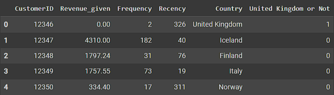
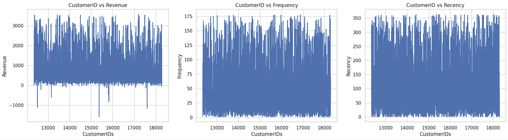
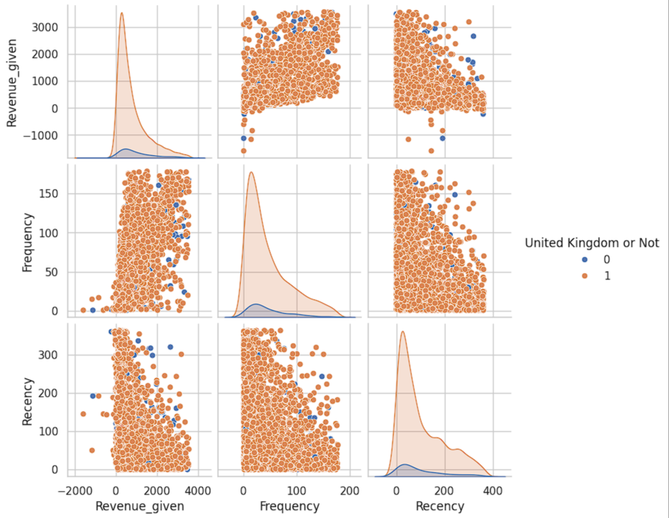
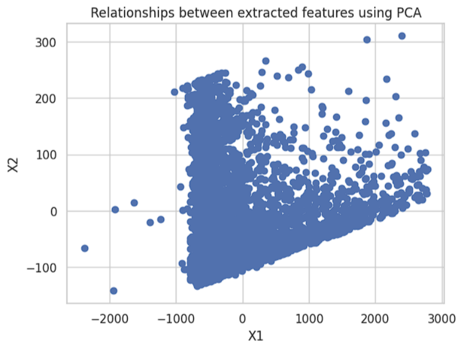
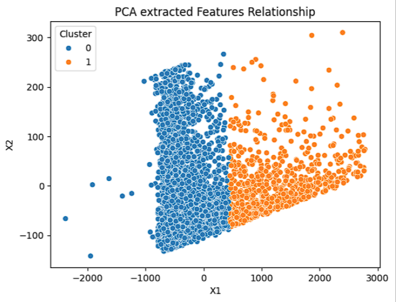
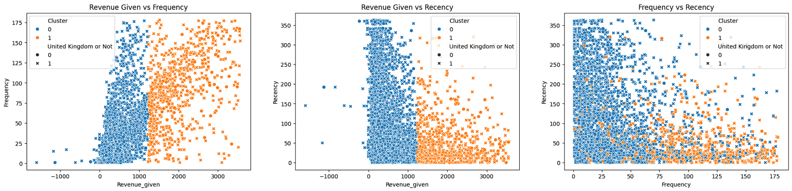
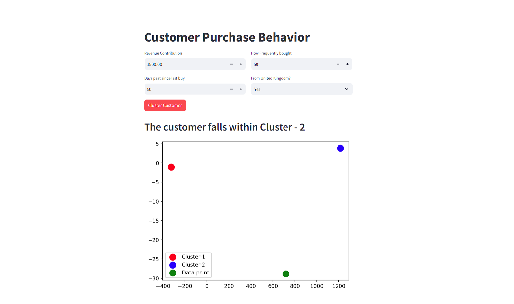

# Customer Purchase Behavior Prediction

<h2>Project Development Journal</h2>

<h3><code style="color:blue">Problem Statement</code></h3>

<strong>We will create a customer purchase behavior prediction system using the following dataset performing data preprocessing, feature engineering and choosing a proper ensemble model with the training and evaluation.</strong>

<h3><code style="color:blue">Dataset Description</code></h3>

<strong>To work on this project, I have chosen <a href="https://www.kaggle.com/datasets/ishanshrivastava28/tata-online-retail-dataset">TATA: Online Retail Dataset</a>. The dataset contains the same file in 2 different formats csv and xlsx. But I will proceed with the .csv file. It contains 541909 rows and 8 columns. The description and purpose of the each column in the dataset are given as follows: -</strong>
<ul>
    <li><strong>InvoiceNo</strong>: Unique id for the order billing.</li>
    <li><strong>StockCode</strong>: A code for the product inventory.</li>
    <li><strong>Description</strong>: Title of the product.</li>
    <li><strong>Quantity</strong>: The number of the particular products ordered.</li>
    <li><strong>InvoiceDate</strong>: Ordering date.</li>
    <li><strong>UnitPrice</strong>: Individual price for the product.</li>
    <li><strong>CustomerID</strong>: Unique id for the ordering customer.</li>
    <li><strong>Country</strong>: Residing country of the customer.</li>
</ul>

<h3><code style="color:blue">Assumption</code></h3>

<strong>As we have to predict the customer purhase behavior based on the given features, so, need to find out the relevant customer characteristics while from the dataset.</strong>

<h3><code style="color:blue">Data Pre-processing</code></h3>

<ul>
    <li><strong>Missing value Handling: -</strong> We got NaN values in the 'CustomerID'. As 'CustomerID' is the unique identifier for each customer, so, having NaN in this column won't let us know the customer. Therefore those rows are deleted.</li>
    <li><strong>Column Dtype Formation: -</strong> The 'CustomerID' was in float64 format. So, I convert it to int format as, it's an unique identifier.</li>
    <li><strong>Feature Engineering: -</strong> We got 4372 unique ids for the customers. So, we have to find these customers characteristics in this dataset. There were a very few features relatable to customers such as, CustomerID, Country. The other features such as StockCode, Description and some others relate to product rather than customers. So, we have to create some new features from these.
        <ul>
            <li><strong>Revenue_given: </strong>Each customer bought different number of products for the unit price. So, we calculated a new column 'Revenue_given' that tells how much the customer has spent ordering products.</li>
            <li><strong>Frequency: </strong>How frequently a customer bought products from the company.</li>
            <li><strong>Recency: </strong>How many days have been past since last buy for a customer.</li>
            <li><strong>United Kingdom Or Not: </strong>We saw that we have the most number of customers from UK, and other values are far away from those values. So, we extracted a new feature from here.</li>
        </ul>
        <strong>Creating some new features relating to the customers we created a new dataframe dropping other columns.</strong>
        

    </li>
    <li><strong>Handling outliers: </strong>Outliers existed in the numeric columns & those were handled.</li>
</ul>

    <table>
        <tr>
            <th>FileName</th>
            <th>Extension</th>
            <th>Rows</th>
            <th>Columns</th>
        </tr>
        <tr>
            <td align="center">Online_Retail_Data_Set</td>
            <td align="center">csv</td>
            <td align="center">541909</td>
            <td align="center">8</td>
        </tr>
        <tr>
            <td align="center">final_dataset</td>
            <td align="center">csv</td>
            <td align="center">3616</td>
            <td align="center">5</td>
        </tr>
    </table>

<h3><code style="color:blue">EDA & Data Visualization</code></h3>

<strong>At first I tried to plot the characteristics extracted from each of the customer. But looking at the relationships between those variables for individual customer doesn't show any characteristics that can differentiate from others or a group of people.</strong>

    

<strong>We plotted one variable vs other variables relationship using pairplots. Even with differentiating the datapoints based on UK residant or not, the datapoints looks crowded. The normal go throgh can't define a boundary line in between these to cluster the data. We can't see any kind of noticable relationships such as, linear or exponential relation between the variables. So, we have to extract features using featured extraction techniques.</strong>

    

<h3><code style="color:blue">Dimensionality Reduction</code></h3>

<strong>I used PCA to extract features into lower dimension and extracted 2 features. Then labeling these features as X1 and X2, I plot the points. But unfortunately my normal go through is not able to find any differences to differentiate the datapoints.</strong>

    

<h3><code style="color:blue">Model Selection</code></h3>

<strong>As the dataset is unsupervised, so, there was no labeling with the data. So, we chose to implement clustering and cluster the same behavioral in the same segment.</strong>

<h3><code style="color:blue">Dataset Splitting</code></h3>

<strong>We can split our dataset into train and test split. As we are working with the unsupervised dataset, then while evaluating the model performance with the test set, we can't ensure it's clustering accuracy because we don't know the ground truth label or which cluster each sample belongs to. That's why we will be using the whole dataset as the training set and finally, evaluate the model performance using unsupervised performance metrics.</strong>

<h3><code style="color:blue">Ensemble Model Implementation</code></h3>

<strong>We choose to implement an ensemble algorithm from scratch using 2 individual clustering algorithms. Then with the help of maximum voting, we decided the final value.</strong>
<ul>
    <li>K-Means</li>
    <li>K-Medoids</li>
</ul>
<strong>The criterion for the individual algorithms were till convergence. It means both the algorithms inside the ensemble will run till their centroids and medoids are found respectively.</strong>

<h3><code style="color:blue">Experimentation and Evaluation</code></h3>

<strong>We will experiment with the own implemented model and the dataset. We will try to cluster our dataset into different number of groups. To evaluate, which group shows good clustering, we will use "Silhoutte Co-efficient" as the evaluation metrics. The value close to +1 means well-seperated clusters, value close to 0 means overlapping clusters with no clear seperations and -1 means the most overlapping clusters.</strong>

    <table>
        <tr>
            <th>Cluster Numbers</th>
            <th>Silhoutte Coefficient</th>
        </tr>
        <tr>
            <td align="center">2</td>
            <td align="center">0.67909</td>
        </tr>
        <tr>
            <td align="center">3</td>
            <td align="center">0.54980</td>
        </tr>
        <tr>
            <td align="center">4</td>
            <td align="center">0.48623</td>
        </tr>
    </table>

<strong>As we increase the number of clusters, our silhoutte coefficient gets far from +1. So, we will proceed with 2 clusters, as it gives the highest silhoutte sccore.</strong>

<h3><code style="color:blue">Post Clustering Analysis</code></h3>

<strong>Now, if we look at the scatter plot with the features after applying PCA, then the datapoints are clearly placed in different regions carrying their respectable clustering characteristics. </strong>

    

<strong>After clustering the datapoints we can see a clear differentiation between the datapoints even in the features before extraction. Looking at the "Revenue_given vs Frequency" and "Revenue_given vs Recency" gives us a clear differentiation. On the contrary, "Frequency vs Recency" scatter plot is not clustering differentiable. Although the categorical variable "United Kingdom Or Not" is present both type of clusters and to me, it doesn't show any significant differentiable characteristics.</strong>

    

<h3><code style="color:blue">Model Deployment</code></h3>

    

